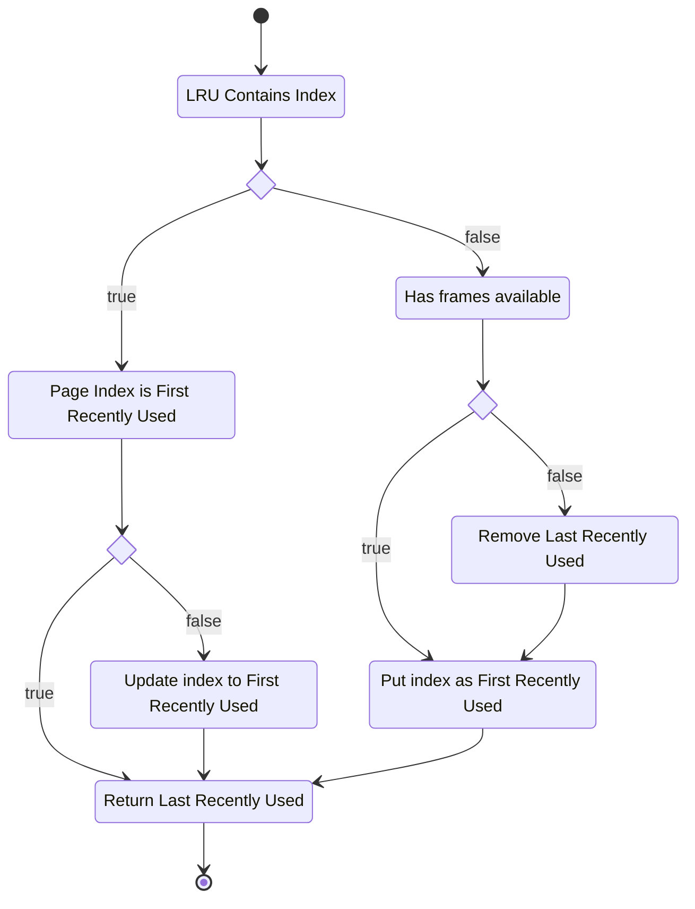
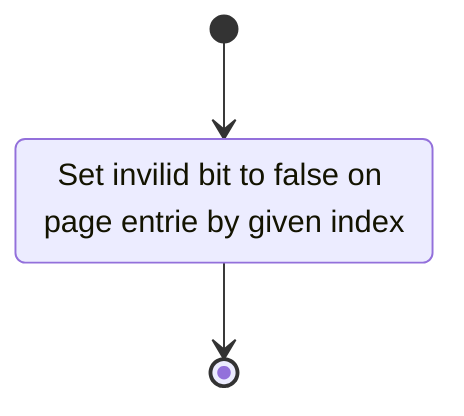
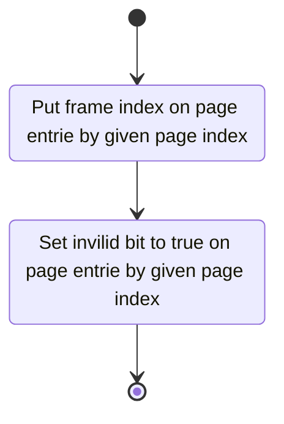
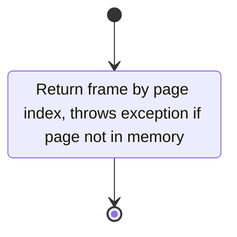
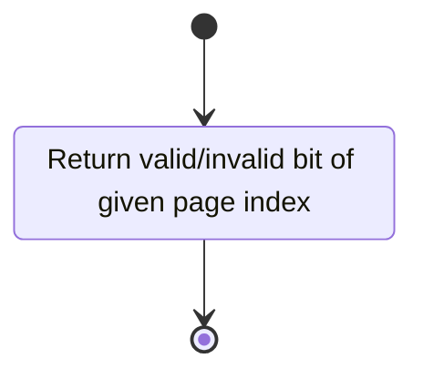
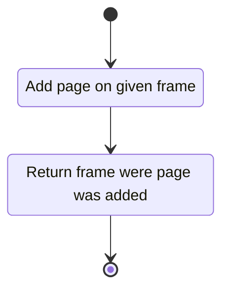
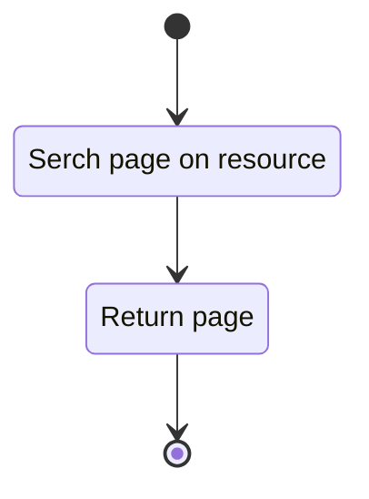
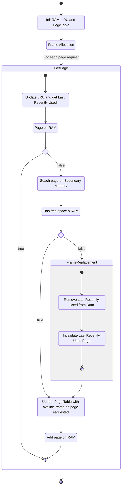

# MyVirtualMemoryManager

Projeto para desenvolver a abstração de um Gestor de Memória Virtual, desenvolvido para a disciplina de Sistemas Operacionais da UFABC, ministrada pelo Prof. Dr. Joao Marcelo Borovina Josko.

- Tradução de endereço
- Gerenciamento de Page Fault
- Algoritmo de Page Replacement

## Como rodar?
Para rodar o programa execute em um terminal, para Linux:

`./gradlew run --args="[RAM_ALLOCATION_SIZE] [NUMBER_OF_REQUEST]"`

Para Windows:

`./gradlew.bat run --args="[RAM_ALLOCATION_SIZE] [NUMBER_OF_REQUEST]"`

Onde as váriavés são:
  - RAM_ALLOCATION_SIZE - Quantidade de RAM que será alocada;
  - NUMBER_OF_REQUEST - Quantidade de requisições de páginas que será feita;
  
## Recursos

### secondary_memory.json
Abstração de memória secundária, é utilizada para ser consultada pela classe Secondary Memory para consulta das páginas.

## Classes
### LRU
Classe responsável por implementar a estrutura de LRU (\textit{last recentry used}), que armazena os índeces das páginas requisitadas e guarda a informação da página utilizada por último.

#### Atributos
  - entries - Índices das páginas requisitadas;
  - frameCount - Quantidade de frames.

#### Métodos
  - addOnLRU(pageIndex)
  
Responsável por adicionar ou atualizar o índice da página na LRU, retorna a página requisitada por último.

### PageTable
Classe responsável por implementar a estrutura de \textit{page table}.

#### Atributos
  - entries - Entradas da `page table`;
  - pageCount - Quantidade de páginas.

#### Métodos
  - removePageEntry(pageIndex)
  
  Responsável atualizar informação que indica que a página com dado índice foi removida da memória.

  - addFrameOnPageEntry(pageIndex, frameIndex)
  
  Responsável atualizar informação que indica que a página com dado índice foi adicionada na memória, guardando o frame dado.

  - addFrameByPage(pageIndex)
  
  Responsável por retornar o frame em que a página está alocada em memória.

  - getFrameByPage(pageIndex)

Responsável por retornar o frame em que a página está alocada em memória.

  - getFrameByPage(pageIndex)

Retorna o `valid/invalid bit` da página dada (página está na memória ou não).

### RAM
Classe responsável por implementar a abstração de RAM.

#### Atributos
  - frames - Frames da RAM;
  - frameCount - Quantidade de frames.
  
#### Métodos
  - addPage(page, frameIndex)
  
Adiciona a página no frame indicado.

### SecondaryMemory

Classe responsável por implementar a abstração de memóriia secundária.

#### Métodos
  - searchPage(pageIndex)
  
Busca no recurso \textit{secondary\_memory.json} a página e a retorna.

### MemoryManager
Classe principal do projeto, contêm a função \textit{main}, ponto inicial do programa, segue o diagrama da execução:

